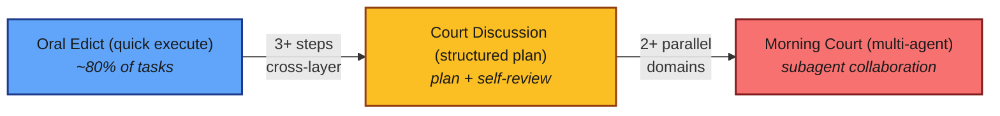
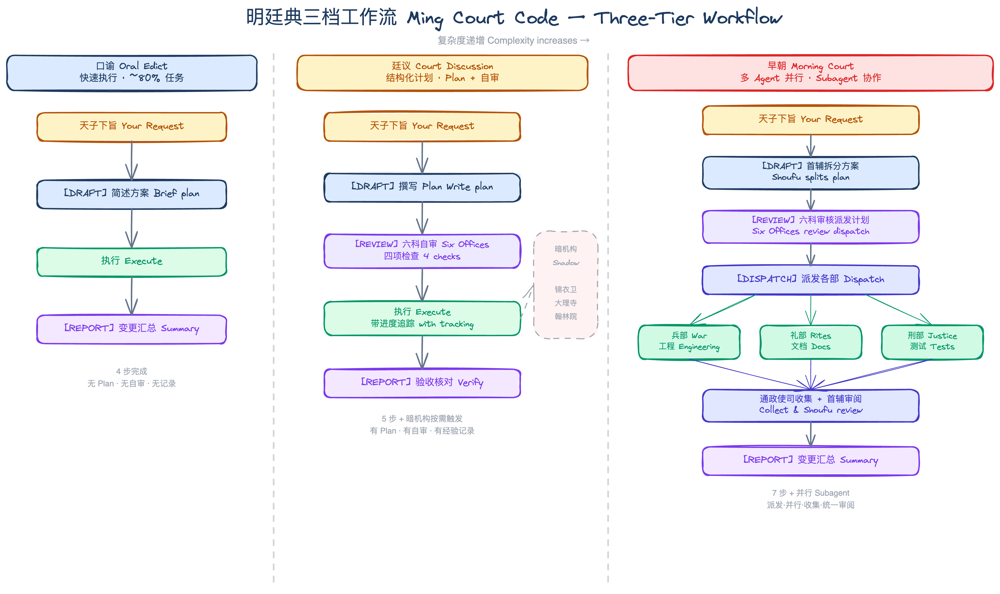
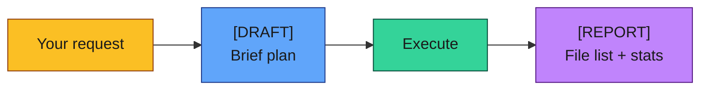
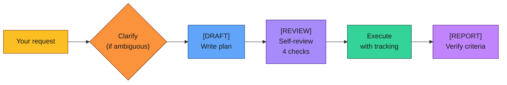
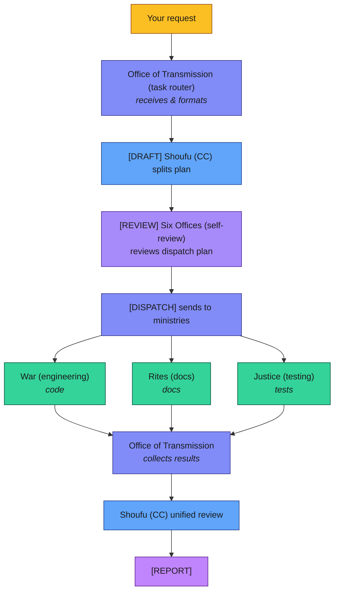
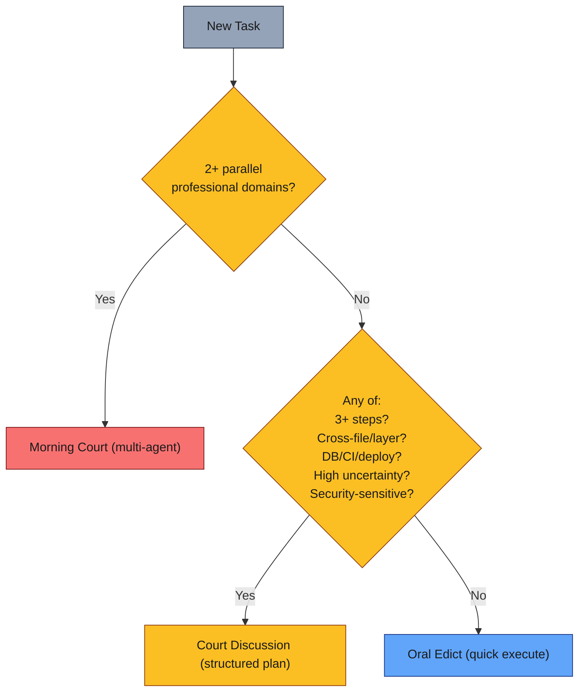
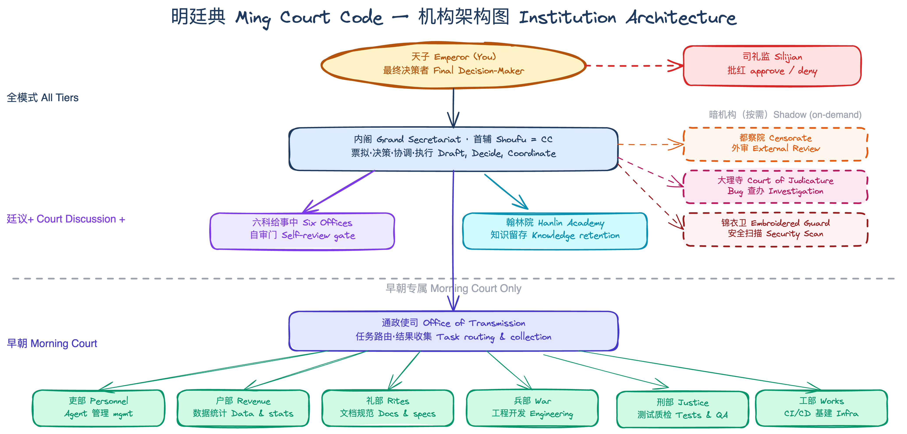

# Ming Court Code — Usage Guide

## Quick Start

```bash
# Install via npx skills
npx skills add shiqkuangsan/oh-my-daily-skills --skill ming-court-code

# Or install the full plugin
npx skills add shiqkuangsan/oh-my-daily-skills
```

Once installed, CC automatically follows the protocol. No configuration needed.

## Understand in 30 Seconds

You are the **Emperor** (final decision-maker). CC is the **Grand Secretary / Shoufu** (main agent). Every task flows through one of three modes, auto-selected by complexity:



That's it. You just talk to CC normally — it picks the right mode and tells you which one it chose.



## Workflow in Action: Oral Edict

**When:** Simple 1-2 step tasks — renaming, fixing typos, small changes.



### Example: Rename a Function

**You say:**

> Rename `getUserName` to snake_case across the codebase

**CC outputs:**

```
[DRAFT]
Grep `getUserName` in src/, rename all occurrences to `get_user_name`,
including function definitions, call sites, and test files.

(executing...)

[REPORT]
Changed files:
- src/utils.ts          (+1, -1)
- src/api/handler.ts    (+2, -2)
- tests/utils.test.ts   (+1, -1)
Total: 3 files, 4 replacements
```

**Your action:** Review the REPORT. Done.

### What CC Does NOT Do in Oral Edict

- No plan file — just a one-paragraph description
- No self-review gate — executes directly
- But shadow institutions (e.g. Hanlin Academy) can still trigger across tiers

## Requirement Clarification (Court Discussion / Morning Court)

Complex tasks may have critical ambiguities in a one-line request. CC evaluates before drafting:

- **Ambiguous** — CC asks 3-5 targeted questions (with options, not open-ended), then drafts after your answers
- **Clear enough** — CC goes straight to DRAFT, no questions for the sake of questions

## Workflow in Action: Court Discussion

**When:** 3+ step tasks, cross-file changes, uncertain requirements, DB/CI/deploy changes, security-sensitive work.



### Example: Add JWT Auth to an Express API

**You say:**

> Add JWT authentication to this Express API

**CC outputs the plan:**

```
[DRAFT]

## Plan: Add JWT Authentication

Steps:
- [ ] Install jsonwebtoken and @types/jsonwebtoken
- [ ] Create middleware/auth.ts with token verification
- [ ] Add auth middleware to protected routes (CRUD endpoints)
- [ ] Add JWT_SECRET to .env.example
- [ ] Write tests for auth flow (valid token, expired, missing)

Acceptance criteria:
- [ ] npm test passes with all new tests green
- [ ] Unauthenticated requests return 401
- [ ] Token expiry is configurable
```

**CC self-reviews (Six Offices — 4 checks):**

```
[REVIEW]
✅ Feasibility: jsonwebtoken is well-maintained, compatible with current Node version
✅ Completeness: covers middleware, route integration, env config, and tests
✅ Risk: JWT_SECRET must not be hardcoded — using env variable
✅ Scope: no feature creep, stays within auth requirements

Review passed. Proceeding to execution.
```

**Embroidered Guard (security scan) triggers automatically:**

```
⚠️ Embroidered Guard activated: detected credentials-related changes
Scanning for:
- [ ] No hardcoded secrets in source files
- [ ] .env listed in .gitignore
- [ ] .env.example contains placeholder, not real value
✅ Security check passed
```

**CC executes with progress tracking:**

```
- [x] Install jsonwebtoken and @types/jsonwebtoken
- [x] Create middleware/auth.ts with token verification
- [x] Add auth middleware to protected routes
- [ ] Add JWT_SECRET to .env.example    ← currently here
- [ ] Write tests for auth flow
```

**CC reports results:**

```
[REPORT]

Acceptance:
- [x] npm test passes — 12/12 tests green (3 new)
- [x] Unauthenticated requests return 401
- [x] Token expiry configurable via JWT_EXPIRY env var

Changed files:
- package.json              (+2, -0)  deps added
- middleware/auth.ts         (new, +42)
- routes/api.ts              (+8, -2)  auth middleware applied
- tests/auth.test.ts         (new, +65)
- .env.example               (+2, -0)
```

**Your action:** Review the REPORT, check acceptance criteria, and confirm. If something looks off, CC will fix it before moving on.

### When Shadow Institutions Trigger

During Court Discussion, shadow institutions may activate automatically:

- **Embroidered Guard (security)** — CC touched `.env` → triggered security scan (as shown above)
- **Court of Judicature (bug investigation)** — if `npm test` had failed, CC would investigate root cause and present a `[VERDICT]` before fixing
- **Hanlin Academy (experience retention)** — if CC discovers a pitfall (e.g. "jsonwebtoken requires `algorithms` to be specified explicitly"), it records the lesson

## Workflow in Action: Morning Court

**When:** Large tasks requiring 2+ distinct professional domains working in parallel. Each ministry has a predefined SOUL template (see `references/souls.md`) used as the subagent's system prompt baseline, ensuring consistent behavior and clear boundaries.



### Example: Docker + Docs + Tests

**You say:**

> Add Docker deployment, update the README, and add unit tests for the auth module

**CC drafts and splits the plan:**

```
[DRAFT]

Detected 3 independent professional domains → Morning Court mode

## Dispatch Plan

### Ministry of War (engineering) — Docker deployment
- Create Dockerfile with multi-stage build
- Create docker-compose.yml with app + postgres
- Add .dockerignore
- Acceptance: `docker compose up` runs successfully

### Ministry of Rites (documentation) — README update
- Add Docker deployment section to README
- Add environment variable reference table
- Update Quick Start with Docker option
- Acceptance: README covers all deployment methods

### Ministry of Justice (testing) — Auth module tests
- Unit tests for token generation and verification
- Integration tests for protected endpoints
- Edge cases: expired token, malformed token, missing header
- Acceptance: coverage > 80% for auth module
```

**Six Offices reviews the dispatch plan:**

```
[REVIEW]
✅ Feasibility: all three domains are independent, safe to parallelize
✅ Completeness: each ministry has clear scope and acceptance criteria
✅ Risk: War needs to coordinate port config with docker-compose
✅ Scope: three well-bounded tasks, no overlap

Review passed.
```

**Tasks dispatched to ministries:**

```
[DISPATCH]
→ Ministry of War: Docker deployment (subagent dispatched)
→ Ministry of Rites: README update (subagent dispatched)
→ Ministry of Justice: Auth tests (subagent dispatched)

Ministries working in parallel...
```

**Results collected and unified review:**

```
Office of Transmission: all 3 ministries reported back.

Shoufu unified review:
- [x] War: Dockerfile builds, compose runs, .dockerignore present
- [x] Rites: README updated with Docker section, env table, Quick Start
- [x] Justice: 8 test cases, auth coverage at 92%
- [x] Cross-check: Docker exposes port 3000, README documents port 3000 ✓

[REPORT]

Changed files:
- Dockerfile               (new, +28)
- docker-compose.yml        (new, +35)
- .dockerignore             (new, +12)
- README.md                 (+45, -3)
- tests/auth.unit.test.ts   (new, +120)
- tests/auth.e2e.test.ts    (new, +85)

Total: 6 files changed, 3 new files
```

**Your action:** Review the REPORT, check cross-domain consistency (e.g. does the README match the actual Docker config?). Approve or request adjustments.

## Auto-Detection & Override

CC picks the mode automatically:



### Override Commands

You can always override:

| Say This                               | Effect                 |
| -------------------------------------- | ---------------------- |
| "use oral edict" or "keep it simple"   | Force Oral Edict       |
| "go court discussion" or "be thorough" | Force Court Discussion |
| "call morning court" or "full team"    | Force Morning Court    |
| "tier up"                              | Shift one tier up      |
| "tier down"                            | Shift one tier down    |

## Stage Markers — What You See, What You Do

| Marker       | What CC Did                          | What You Should Do                         |
| ------------ | ------------------------------------ | ------------------------------------------ |
| `[DRAFT]`    | Described its approach / wrote plan  | Review the plan, confirm or adjust         |
| `[REVIEW]`   | Self-reviewed and passed 4 checks    | Check if the review makes sense            |
| `[DISPATCH]` | Sent tasks to parallel ministries    | Wait for results                           |
| `[VERDICT]`  | Investigated a bug, presenting cause | Approve the diagnosis before CC fixes it   |
| `[REPORT]`   | Summarized all changes               | Final review — accept or request revisions |

If you don't see an expected marker, CC skipped that step. Say "tier up" to enforce more ceremony.

## Shadow Institutions — When They Appear

These activate based on triggers, regardless of which mode you're in:

| Institution                             | Triggers When                                            | What You'll See                                                    |
| --------------------------------------- | -------------------------------------------------------- | ------------------------------------------------------------------ |
| Embroidered Guard (security scan)       | CC touches `.env`, API keys, permissions, or deps        | Security checklist, halts if secrets leaked                        |
| Court of Judicature (bug investigation) | Tests fail or runtime errors occur                       | `[VERDICT]` with evidence and root cause — waits for your approval |
| Hanlin Academy (experience retention)   | CC finds a pitfall, gets corrected, or sees repeat issue | Records lesson in project's designated location                    |
| Censorate (external review)             | Before PR submission (suggested, not automatic)          | Deep self-review or delegates to Codex/Gemini if available         |

## Tips

- **Start with Oral Edict** — most tasks don't need more
- **Watch for CC's tier suggestions** — if CC says "I recommend Court Discussion", it detected complexity
- **Stage markers are your dashboard** — no `[DRAFT]`? CC skipped planning
- **You can always say "tier down"** — if the ceremony feels excessive for the task
- **Censorate is optional** — only use if you have external review tools or want CC's deep self-review

## Reference: Institution Map

```mermaid
graph TD
    Emperor["Emperor (You · final decision)"]

    subgraph always ["All Tiers"]
        Silijian["Silijian (approval gate)<br/><i>user approve / deny</i>"]
        GS["Grand Secretariat · Shoufu (CC main agent)<br/><i>plan · decide · coordinate · execute</i>"]
    end

    subgraph court ["Court Discussion+"]
        SixOff["Six Offices (self-review)<br/><i>feasibility · completeness · risk · scope</i>"]
        Hanlin["Hanlin Academy (experience retention)<br/><i>records pitfalls & corrections</i>"]
        Censorate["Censorate (external review)<br/><i>Codex / Gemini / deep self-review</i>"]
        Judicature["Court of Judicature (bug investigation)<br/><i>investigate before fixing</i>"]
        Guard["Embroidered Guard (security scan)<br/><i>secrets · permissions · deps</i>"]
    end

    subgraph morning ["Morning Court Only"]
        OT["Office of Transmission (task router)<br/><i>dispatch · collect</i>"]
        Personnel["Personnel (agent mgmt)"]
        Revenue["Revenue (data & stats)"]
        Rites["Rites (docs & specs)"]
        War["War (engineering)"]
        Justice["Justice (tests & QA)"]
        Works["Works (infrastructure)"]
    end

    Emperor --> Silijian
    Emperor --> GS
    GS --> SixOff
    GS --> Hanlin
    GS -.-> Censorate
    GS -.-> Judicature
    GS -.-> Guard
    GS --> OT
    OT --> Personnel
    OT --> Revenue
    OT --> Rites
    OT --> War
    OT --> Justice
    OT --> Works

    style Emperor fill:#fbbf24,stroke:#92400e,color:#1a1a1a,stroke-width:3px
    style Silijian fill:#f87171,stroke:#7f1d1d,color:#1a1a1a,stroke-width:2px
    style GS fill:#60a5fa,stroke:#1e3a8a,color:#1a1a1a,stroke-width:2px
    style SixOff fill:#a78bfa,stroke:#4c1d95,color:#1a1a1a
    style Hanlin fill:#22d3ee,stroke:#164e63,color:#1a1a1a
    style Censorate fill:#fb923c,stroke:#7c2d12,color:#1a1a1a
    style Judicature fill:#f472b6,stroke:#831843,color:#1a1a1a
    style Guard fill:#fca5a5,stroke:#7f1d1d,color:#1a1a1a
    style OT fill:#818cf8,stroke:#312e81,color:#1a1a1a
    style Personnel fill:#34d399,stroke:#064e3b,color:#1a1a1a
    style Revenue fill:#34d399,stroke:#064e3b,color:#1a1a1a
    style Rites fill:#34d399,stroke:#064e3b,color:#1a1a1a
    style War fill:#34d399,stroke:#064e3b,color:#1a1a1a
    style Justice fill:#34d399,stroke:#064e3b,color:#1a1a1a
    style Works fill:#34d399,stroke:#064e3b,color:#1a1a1a
```





Solid lines = always active. Dashed lines = on-demand activation.

## Excalidraw Diagrams

Open at [excalidraw.com](https://excalidraw.com) for interactive hand-drawn style views:

- [Three-Tier Workflow](ming-court-code-workflow.excalidraw) — side-by-side comparison of Oral Edict / Court Discussion / Morning Court flows
- [Institution Architecture](ming-court-code-architecture.excalidraw) — full institution hierarchy and relationships
