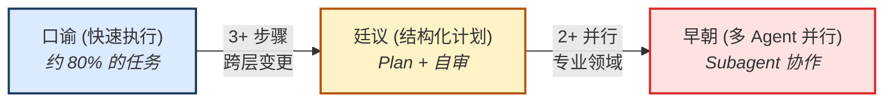
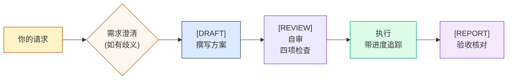
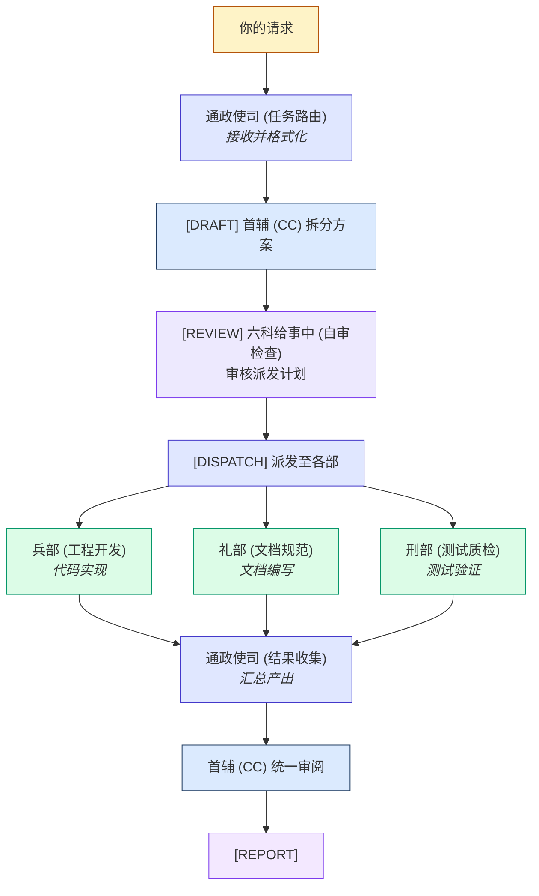
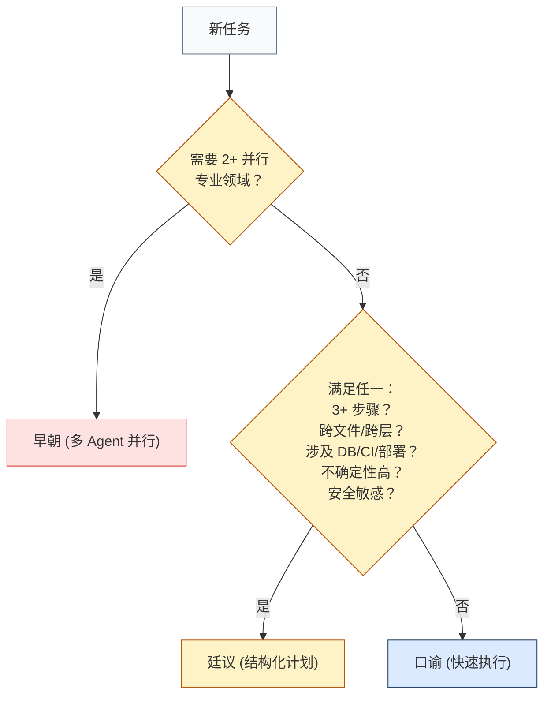
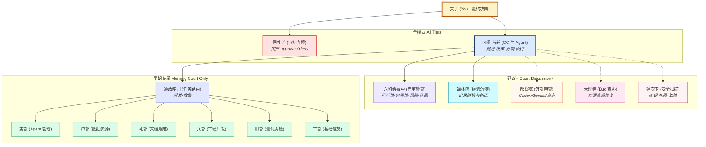

# 明廷典 — 使用指南

## 快速开始

```bash
# 通过 npx skills 安装
npx skills add shiqkuangsan/oh-my-daily-skills --skill ming-court-code

# 或安装完整插件
npx skills add shiqkuangsan/oh-my-daily-skills
```

安装后 CC 自动遵循协议，无需额外配置。

## 30 秒理解

你是**天子**（最终决策者）。CC 是**内阁首辅**（主 Agent）。每项任务自动进入三档模式之一：



就这样。你正常跟 CC 说话，它自动选模式并告知你用了哪一档。


## 实战工作流：口谕

**适用场景：** 1-2 步的简单任务——重命名、修 typo、加个小方法。


### 示例：重命名函数

**你说：**

> 把 `getUserName` 改成 snake_case

**CC 输出：**

```
[DRAFT]
在 src/ 下 grep getUserName，找到 3 处引用，
统一改为 get_user_name。

（执行中...）

[REPORT]
变更文件：
- src/utils.ts          (+1, -1)
- src/api/handler.ts    (+2, -2)
- tests/utils.test.ts   (+1, -1)
合计: 3 个文件, 4 处替换
```

**你需要做什么：** 看一眼 REPORT，确认即可。

### 口谕模式下 CC 不会做什么

- 不写 plan 文件——只有一段话简述
- 不做自审门控——直接执行
- 但暗机构（如翰林院）仍可按触发条件跨级别激活

## 需求澄清（廷议 / 早朝共有）

复杂任务中，一句话描述可能存在关键歧义。CC 会在写方案前评估是否需要澄清：

- **有歧义** — CC 提出 3-5 个针对性问题（带选项，不是开放式），你答完后再出 DRAFT
- **无歧义** — 直接出 DRAFT，不为问而问

## 实战工作流：廷议

**适用场景：** 3 步以上、跨文件变更、需求不明确、涉及 DB/CI/部署、安全敏感操作。



### 示例：给 Express API 加 JWT 认证

**你说：**

> 给这个项目加 JWT auth

**CC 输出方案：**

```
[DRAFT]

## Plan: 添加 JWT 认证

步骤：
- [ ] 安装 jsonwebtoken 和 @types/jsonwebtoken
- [ ] 创建 middleware/auth.ts，实现 token 验证
- [ ] 在受保护路由（CRUD 接口）添加 auth 中间件
- [ ] 在 .env.example 中添加 JWT_SECRET
- [ ] 编写认证流程测试（有效 token、过期、缺失）

验收标准：
- [ ] npm test 全部通过，新测试绿灯
- [ ] 未认证请求返回 401
- [ ] Token 过期时间可配置
```

**CC 自审（六科给事中——四项检查）：**

```
[REVIEW]
✅ 可行性：jsonwebtoken 维护良好，兼容当前 Node 版本
✅ 完整性：覆盖中间件、路由集成、环境配置、测试
✅ 风险：JWT_SECRET 不能硬编码——使用环境变量
✅ 范围：未超出认证需求，无功能蔓延

自审通过，开始执行。
```

**锦衣卫（安全扫描）自动触发：**

```
⚠️ 锦衣卫启动：检测到凭证相关变更
扫描项：
- [ ] 源码中无硬编码密钥
- [ ] .env 已在 .gitignore 中
- [ ] .env.example 使用占位符，非真实值
✅ 安全检查通过
```

**CC 边执行边打勾：**

```
- [x] 安装 jsonwebtoken 和 @types/jsonwebtoken
- [x] 创建 middleware/auth.ts
- [x] 在受保护路由添加 auth 中间件
- [ ] 在 .env.example 中添加 JWT_SECRET    ← 当前进度
- [ ] 编写认证流程测试
```

**CC 报告结果：**

```
[REPORT]

验收：
- [x] npm test 通过 — 12/12 测试绿灯（新增 3 个）
- [x] 未认证请求返回 401
- [x] Token 过期时间可通过 JWT_EXPIRY 环境变量配置

变更文件：
- package.json              (+2, -0)  新增依赖
- middleware/auth.ts         (新增, +42)
- routes/api.ts              (+8, -2)  应用 auth 中间件
- tests/auth.test.ts         (新增, +65)
- .env.example               (+2, -0)
```

**你需要做什么：** 审阅 REPORT，逐条核对验收标准。发现问题直接说，CC 会修正后重新报告。

### 暗机构何时触发

廷议过程中，暗机构可能自动激活：

- **锦衣卫（安全扫描）** — CC 碰到了 `.env` → 自动触发安全扫描（如上示例）
- **大理寺（Bug 查办）** — 如果 `npm test` 失败了，CC 会先调查根因，呈上 `[VERDICT]`（判决书）等你批准后才修复
- **翰林院（经验沉淀）** — 如果 CC 发现了坑（比如 "jsonwebtoken 必须显式指定 `algorithms`"），会主动记录经验

## 实战工作流：早朝

**适用场景：** 需要 2 个以上独立专业领域并行协作的大型任务。每个部有预定义的 SOUL 模板（见 `references/souls.md`），作为 subagent 的 system prompt 基线，确保各部行为一致、职责清晰。



### 示例：Docker + 文档 + 测试

**你说：**

> 加 Docker 部署、更新 README、补充 auth 模块的单元测试

**CC 起草并拆分方案：**

```
[DRAFT]

检测到 3 个独立专业领域 → 启用早朝模式

## 派发计划

### 兵部 (工程开发) — Docker 部署
- 创建多阶段构建 Dockerfile
- 创建 docker-compose.yml（app + postgres）
- 添加 .dockerignore
- 验收：docker compose up 可正常运行

### 礼部 (文档规范) — README 更新
- 在 README 中新增 Docker 部署章节
- 添加环境变量参考表
- 更新 Quick Start 增加 Docker 方式
- 验收：README 覆盖所有部署方式

### 刑部 (测试质检) — Auth 模块测试
- Token 生成和验证的单元测试
- 受保护接口的集成测试
- 边界情况：过期 token、格式错误、缺少 header
- 验收：auth 模块覆盖率 > 80%
```

**六科给事中审核派发计划：**

```
[REVIEW]
✅ 可行性：三个领域相互独立，可安全并行
✅ 完整性：每个部门有明确范围和验收标准
✅ 风险：兵部需注意端口配置与 docker-compose 一致
✅ 范围：三项任务边界清晰，无重叠

自审通过。
```

**任务派发至各部：**

```
[DISPATCH]
→ 兵部：Docker 部署（subagent 已派发）
→ 礼部：README 更新（subagent 已派发）
→ 刑部：Auth 测试（subagent 已派发）

各部并行工作中...
```

**结果收集与首辅统一审阅：**

```
通政使司：3 个部门均已回报。

首辅统一审阅：
- [x] 兵部：Dockerfile 可构建，compose 可运行，.dockerignore 就位
- [x] 礼部：README 已更新 Docker 章节、环境变量表、Quick Start
- [x] 刑部：8 个测试用例，auth 覆盖率 92%
- [x] 交叉核查：Docker 暴露端口 3000，README 文档端口 3000 ✓

[REPORT]

变更文件：
- Dockerfile               (新增, +28)
- docker-compose.yml        (新增, +35)
- .dockerignore             (新增, +12)
- README.md                 (+45, -3)
- tests/auth.unit.test.ts   (新增, +120)
- tests/auth.e2e.test.ts    (新增, +85)

合计: 6 个文件变更, 3 个新增文件
```

**你需要做什么：** 审阅 REPORT，重点检查跨部门一致性（比如 README 描述的 Docker 配置和实际是否一致）。确认无误或要求调整。

## 自动选档 & 手动覆盖

CC 根据任务特征自动选择模式：



### 手动覆盖

你可以随时覆盖自动选择：

| 说法                         | 效果     |
| ---------------------------- | -------- |
| "用口谕" 或 "keep it simple" | 强制口谕 |
| "开廷议" 或 "be thorough"    | 强制廷议 |
| "召早朝" 或 "full team"      | 强制早朝 |
| "tier up"                    | 上调一档 |
| "tier down"                  | 下调一档 |

## 阶段标记——看到什么，做什么

| 标记         | CC 做了什么              | 你该做什么                    |
| ------------ | ------------------------ | ----------------------------- |
| `[DRAFT]`    | 描述方案 / 撰写 plan     | 审阅方案，确认或调整          |
| `[REVIEW]`   | 自审通过四项检查         | 检查自审结论是否合理          |
| `[DISPATCH]` | 任务派发到并行各部       | 等待结果                      |
| `[VERDICT]`  | 调查了 Bug，呈上根因分析 | 批准诊断结论，CC 才会动手修复 |
| `[REPORT]`   | 汇总所有变更             | 最终审阅——接受或要求修改      |

没看到该出现的标记？说明 CC 跳过了那个步骤。说 "tier up" 可以强制更严格的仪制。

## 暗机构——何时出现

这些机构根据触发条件自动激活，不受模式限制：

| 机构              | 触发条件                              | 你会看到什么                                   |
| ----------------- | ------------------------------------- | ---------------------------------------------- |
| 锦衣卫 (安全扫描) | CC 涉及 `.env`、密钥、权限、依赖升级  | 安全检查清单，发现泄露则中止                   |
| 大理寺 (Bug 查办) | 测试失败或运行时错误                  | `[VERDICT]` 判决书含证据和根因——等你批准才修复 |
| 翰林院 (经验沉淀) | CC 发现坑、被纠正、或同一问题出现两次 | 记录经验到项目指定位置                         |
| 都察院 (外部审查) | 提 PR 前建议使用（非自动触发）        | 深度自审，或交给 Codex/Gemini（如果有的话）    |

## 使用技巧

- **从口谕开始** —— 大多数任务不需要更多仪制
- **留意 CC 的模式建议** —— CC 说"建议廷议"说明它检测到了复杂度
- **阶段标记是你的仪表盘** —— 没有 `[DRAFT]`？说明 CC 跳过了规划
- **随时可以说 "tier down"** —— 如果仪制感觉过于隆重
- **都察院是可选的** —— 仅在有外部审查工具或需要 CC 深度自审时使用

## 附录：机构全图




实线 = 常驻激活。虚线 = 按需激活。

## Excalidraw 图解

在 [excalidraw.com](https://excalidraw.com) 打开可获得交互式手绘风格视图：

- [三档工作流对比](ming-court-code-workflow.excalidraw) — 口谕 / 廷议 / 早朝 流程并排对比
- [机构架构图](ming-court-code-architecture.excalidraw) — 完整机构层级与关系
