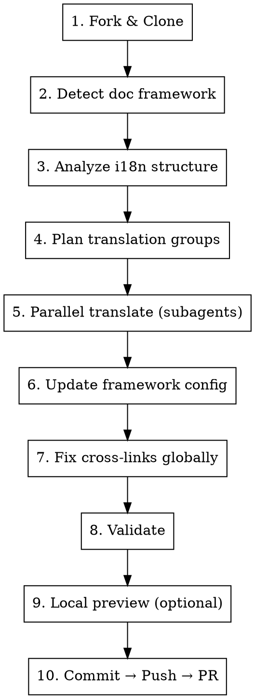

# Docs i18n PR

Fork an open-source repo, translate its documentation site, and submit a PR — fully automated.

## When to Activate

- User shares a repo URL and wants to submit a translation PR
- User says "translate docs", "翻译文档", "给文档提个中文 PR"
- User uses `/docs-i18n-pr <repo-url> [target-lang]`

**Default target language:** `zh` (Simplified Chinese) unless specified otherwise.

## Prerequisites

```bash
# Required
gh auth status          # GitHub CLI authenticated
git lfs install         # Some repos use LFS

# Optional (for local preview)
which mintlify          # Mintlify sites
which npx               # VitePress / Docusaurus / Nextra sites
```

## Workflow



### Step 1: Fork & Clone

```bash
gh repo fork <owner>/<repo> --clone=false
gh repo clone <your-fork>
git checkout -b docs/add-<lang>-translation
```

**Watch for:** repos using Git LFS — install `git-lfs` before clone if `.gitattributes` contains LFS filters.

### Step 2: Detect Doc Framework

Scan the docs directory for framework signatures:

| Framework      | Detection signature             | Config file                              |
| -------------- | ------------------------------- | ---------------------------------------- |
| **Mintlify**   | `docs.json` or `mint.json`      | `docs.json` / `mint.json`                |
| **VitePress**  | `.vitepress/` directory         | `.vitepress/config.ts`                   |
| **Docusaurus** | `docusaurus.config.js/ts`       | `docusaurus.config.js` + `i18n/`         |
| **Nextra**     | `next.config.*` + `_meta.json`  | `next.config.mjs` + `_meta.json` per dir |
| **GitBook**    | `.gitbook.yaml` or `SUMMARY.md` | `.gitbook.yaml`                          |

### Step 3: Analyze i18n Structure

Look for existing translations to understand the project's i18n pattern:

```bash
# Find existing locale directories
find docs/ -maxdepth 1 -type d   # e.g., docs/vi/, docs/ja/

# Check config for language navigation
cat docs/docs.json | python3 -c "import json,sys; print(json.dumps(json.load(sys.stdin).get('navigation',{}).get('languages',[]), indent=2))"
```

**Key decisions:**

- Directory structure: `docs/<lang>/` (most common) vs `i18n/<lang>/` (Docusaurus)
- Link prefix pattern: `/zh/features/...` vs `/features/...`
- What's translatable: frontmatter fields, body, config nav labels

### Step 4: Plan Translation Groups

List all source files, group by directory for parallel subagent dispatch:

```bash
find docs/ -name "*.mdx" -o -name "*.md" | grep -v "node_modules\|<existing-langs>" | sort
```

**Grouping strategy** — one subagent per directory:

| Group               | Typical size | Example                              |
| ------------------- | ------------ | ------------------------------------ |
| Root pages          | 3-5 files    | index, quickstart, installation      |
| Per feature dir     | 5-15 files   | features/, databases/                |
| Small dirs combined | 3-12 files   | customization/ + api/ + development/ |

Aim for **3-5 subagents** with roughly balanced workload.

### Step 5: Parallel Translate via Subagents

Dispatch all subagents in a **single message** for true parallelism.

**Subagent prompt template:**

```
Translate the following English mdx files to <target-lang>, placing output in docs/<lang>/<path>.

Translation rules:
1. Translate frontmatter title, description, sidebarTitle
2. Translate markdown body naturally (not machine-translation style)
3. Keep code blocks, URLs, CLI commands, technical terms in English
4. Keep product name "<ProductName>" as-is
5. Update internal link hrefs to /<lang>/ prefix
6. Keep component structure (Card, CardGroup, Frame, etc.) intact

Files to translate:
- docs/<path1> → docs/<lang>/<path1>
- docs/<path2> → docs/<lang>/<path2>
...

Reference: check docs/<existing-lang>/ for structure conventions.
Working directory: <repo-path>
```

**Critical rule in prompt:** "Update internal link hrefs to `/<lang>/` prefix" — this is the #1 source of review comments if missed.

### Step 6: Update Framework Config

Add the new language to the framework's navigation config.

**Mintlify** (`docs.json`):

- Add new entry to `navigation.languages[]` array
- Translate tab names, group names
- Prefix all page paths with `<lang>/`
- Validate JSON: `python3 -c "import json; json.load(open('docs/docs.json')); print('OK')"`

**VitePress** (`.vitepress/config.ts`):

- Add locale config to `locales` object
- Add sidebar and nav for new locale

**Docusaurus** (`docusaurus.config.js`):

- Add locale to `i18n.locales` array
- Translation files go in `i18n/<lang>/`

**Nextra**:

- Add `_meta.<lang>.json` files per directory
- Update `next.config.mjs` i18n config

### Step 7: Fix Cross-Links Globally

**This step is mandatory.** Subagents often miss internal links in body text and Card components.

```bash
# Scan for missed links (adjust patterns per framework)
grep -rn 'href="/features/\|href="/customization/\|href="/databases/\|](/features/\|](/customization/\|](/databases/' docs/<lang>/ --include="*.mdx" --include="*.md"

# Batch fix with sed
find docs/<lang> -name "*.mdx" -o -name "*.md" | xargs sed -i '' \
  -e 's|href="/features/|href="/<lang>/features/|g' \
  -e 's|href="/customization/|href="/<lang>/customization/|g' \
  -e 's|href="/databases/|href="/<lang>/databases/|g' \
  -e 's|](/features/|](/<lang>/features/|g' \
  -e 's|](/customization/|](/<lang>/customization/|g' \
  -e 's|](/databases/|](/<lang>/databases/|g'

# Verify zero remaining
grep -rn 'href="/features/\|](/features/' docs/<lang>/ --include="*.mdx" | wc -l
# Expected: 0
```

**Adapt the grep/sed patterns** to match the project's actual directory structure. The example above covers the most common paths — add more as needed.

### Step 8: Validate

```bash
# JSON/YAML config validity
python3 -c "import json; json.load(open('docs/docs.json')); print('OK')"

# File count matches source
echo "Source: $(find docs/ -name '*.mdx' -not -path '*/vi/*' -not -path '*/zh/*' | wc -l)"
echo "Translation: $(find docs/<lang>/ -name '*.mdx' | wc -l)"

# No broken internal links (zero non-prefixed links)
grep -rn 'href="/[a-z]' docs/<lang>/ --include="*.mdx" | grep -v "href=\"/<lang>/" | grep -v "http"
```

### Step 9: Local Preview (Optional)

| Framework  | Command                        |
| ---------- | ------------------------------ |
| Mintlify   | `cd docs && mintlify dev`      |
| VitePress  | `npm run docs:dev`             |
| Docusaurus | `npm start -- --locale <lang>` |
| Nextra     | `npm run dev`                  |

Preview at `http://localhost:3000`, switch language in the UI.

### Step 10: Commit, Push & PR

**Wait for user confirmation before each step (commit / push / PR).**

```bash
# Stage
git add docs/<lang>/ docs/docs.json  # or whatever config file

# Commit
git commit -m "docs: add <Language> (<lang>) translation"

# Push
git push -u origin docs/add-<lang>-translation

# PR
gh pr create --repo <upstream> \
  --head <your-fork>:docs/add-<lang>-translation \
  --base main \
  --title "docs: add <Language> (<lang>) translation" \
  --body "$(cat <<'EOF'
## Summary
- Add complete <Language> translation for the documentation site (`docs/<lang>/`)
- Add <Language> language navigation configuration
- <N> translated files covering all sections

## Details
Translation follows the same structure as the existing `<ref-lang>` translation.
[file count table by directory]

### Translation guidelines followed:
- Frontmatter title/description translated
- Technical terms kept in English
- Product name kept as-is
- Code blocks, URLs, CLI commands unchanged
- Internal links updated to `/<lang>/` prefix
EOF
)"
```

**Post-PR:** remind user to sign CLA if the repo requires it (check PR comments from bot).

## Common Pitfalls

| Pitfall                               | Prevention                                                |
| ------------------------------------- | --------------------------------------------------------- |
| Cross-links missing `/<lang>/` prefix | Step 7 batch fix + verify zero remaining                  |
| Git LFS not installed                 | Check `.gitattributes` before clone                       |
| Config JSON/YAML syntax error         | Always validate after editing                             |
| Subagent translates product name      | Explicit rule in prompt: "Keep `<Name>` as-is"            |
| Duplicate page in nav config          | Compare source config carefully (upstream may have dupes) |
| Forgetting CLA                        | Check PR bot comments, remind user                        |
